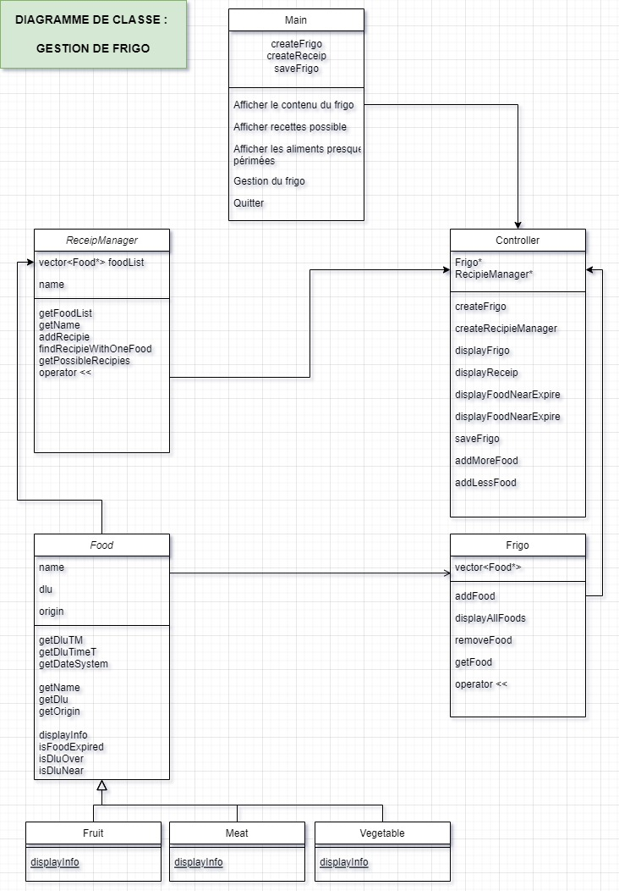

# PROJET C++ 
# APPLICATION DE GESTION DE FRIGO

 @authors  Jia Jiunn Huynh - Olivier Wafflard - Clement Tauzin
 @date 2023/08/04

**Utilisation de github** : https://github.com/ClemTauzin/projetcpp
- Utilisation des branches pour le développement
********************************************************
Contexte :
Vous allez devoir imaginer un contexte pertinent dans lequel vous allez mettre en place une application en C++ avec les mécanismes d'installation de bibliothèque et les fichiers externes. Dans le programme que vous allez construire, vous aurez deux jours pour penser aux mécanismes qui seront les plus pertinents. Vous êtes libre d'utiliser les moyens dont vous disposez. Le seul prérequis est le fait d'utiliser tout ce que vous avez abordé. Après cela, il faudra créer une documentation pour présenter votre application, son rôle et les évolutions futures auxquelles vous aurez pensé. Tous les choix doivent être pertinents.

*********************************************************

## @version 1.0 :
- L'application charge les aliments du fichier sauvegardé lors du démarrage, tout en prenant soin d'éliminer les aliments périmés, et sauvegarde le contenu du frigo lors de la fermeture de l'application
- l'utilisateur se voit proposé 
    + d'afficher les aliments contenus dans le frigo
    + d'afficher les recettes réalisables à partir des aliments contenus dans le frigo
    + d'afficher la liste des aliments bientôt périmés contenus dans le frigo
    + d'ajouter des aliments dans le frigo
    + de supprimer des aliments contenus dans le frigo

Le but de l'exercice était de mettre en pratique différentes notions vues lors de la formation C++
Les notions suivantes ont été réexploitées dans cet exercice :
- classe abstaite / classe dérivée
- vecteurs et pointeurs
- dynamic cast
- conditions et boucles
- écriture et lecture de fichier

### Diagramme UML de l'existant : 

## @version future - update :
- listing des recettes enregistrées
- ajout de recettes
- suppression des aliments du frigo correspondant à une recette lorsque celle ci est réalisée
- réalisation d'un fichier enregistrant les recettes réalisées, la date de réalisation et les aliments utilisés à cette occasion
- prise en compte des erreurs utilisateurs lors de la saisie des données / vision pessimiste
- (réalisation d'un système d'achat fictif de ressources + possibilité d'obtenir un coup de revient d'un plat en prenant en compte de prix des aliments utilisés)

 
To compile, enter the following command : g++ -std=c++11 *.cpp

To execute, enter the following command : ./a.out 